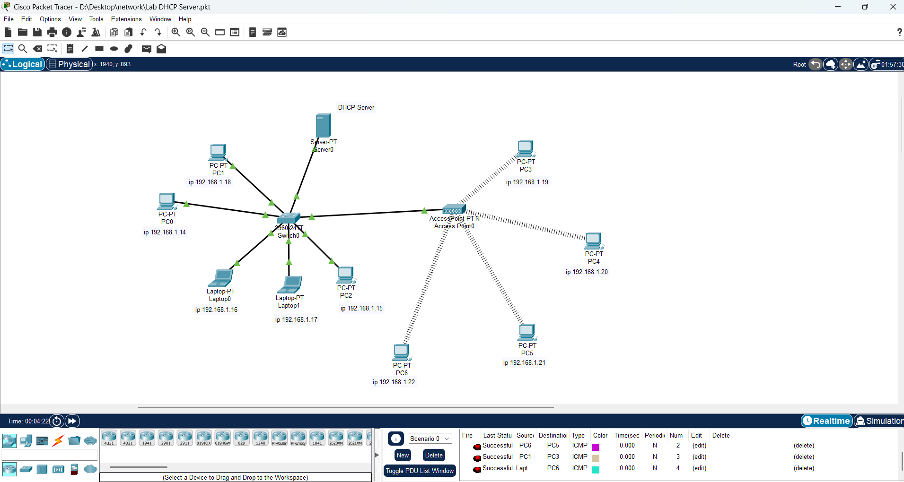

# 🧩 DHCP Server Lab (Cisco Packet Tracer)

## 📘 รายละเอียดโปรเจกต์
โปรเจกต์นี้เป็นการจำลองระบบแจก IP Address แบบอัตโนมัติภายในเครือข่าย  
โดยใช้ **DHCP Server** เพื่อบริหารจัดการ IP และลดภาระการตั้งค่า IP ด้วยตนเอง

---

## ⚙️ สิ่งที่ศึกษา
- การติดตั้งและตั้งค่า **DHCP Server** ภายใน Packet Tracer  
- การกำหนด IP Scope และ Default Gateway ให้เครื่องลูกข่าย  
- การเชื่อมต่อระหว่าง Switch และอุปกรณ์ปลายทาง  
- การตรวจสอบผลลัพธ์ด้วยคำสั่ง `ipconfig` และ `ping`

---

## 🖼️ ภาพโครงสร้างเครือข่าย

> แสดงการเชื่อมต่อ DHCP Server กับ Switch และ PC ภายในวง 192.168.1.0/24

---

🧠 ผลลัพธ์จากการทดลอง  
- อุปกรณ์ทุกเครื่องได้รับ IP อัตโนมัติจาก DHCP Server (Server0) สำเร็จ  
- การ Ping ระหว่างเครื่องในวงเครือข่ายทำงานได้ถูกต้อง  
- สามารถตรวจสอบการแจก IP ได้จาก **DHCP Table** ภายในแท็บ `Services > DHCP` ของ Server  

---

## 🧾 ไฟล์ที่เกี่ยวข้อง
- `Lab_DHCP_Server.pkt` — ไฟล์จำลองระบบใน Packet Tracer  
- `DHCP-Server.png` — ภาพ Topology ของระบบ DHCP Lab

---

[⬅️ กลับไปหน้า Lab รวม](https://github.com/supanatm88/network-lab-project)
